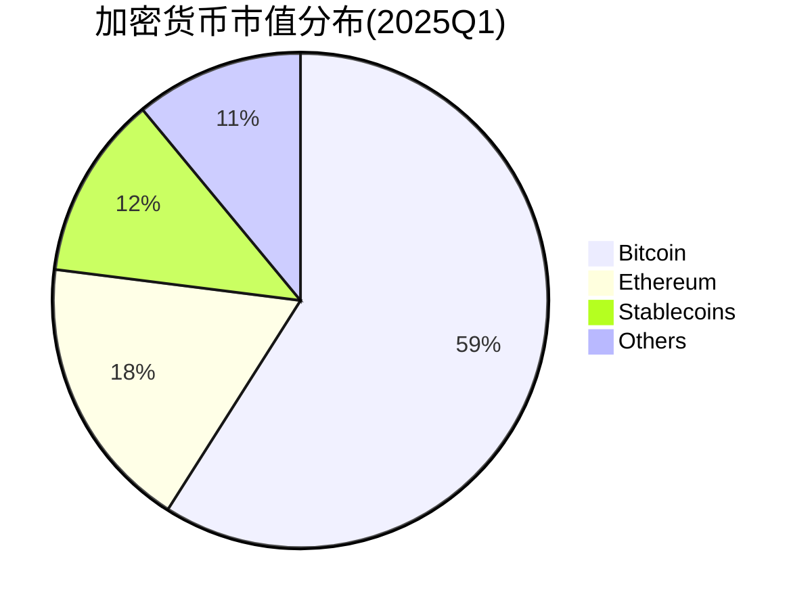

# 2025年加密货币行业分析报告：比特币的崛起与加密货币的未来趋势

## 加密货币行业现状与市场规模

全球加密货币市场在2025年迎来里程碑式发展。截至本年度1月，行业总市值突破**3.6万亿美元**，其中比特币以59%的市场份额占据绝对主导地位。这一数据不仅超越沙特阿美、白银和Meta等传统资产，更标志着加密货币正式进入主流资产配置范畴。

### 关键发展节点回顾
- **2009年**：比特币白皮书发布，区块链技术正式落地
- **2020-2023年**：DeFi协议锁仓量增长超400%，NFT交易规模突破千亿美元
- **2024年Q4**：美国SEC批准首批现货比特币ETF，单月资金流入超200亿美元

**核心数据对比表：**
| 指标                | 2023年数据 | 2025年数据 | 增长率 |
|---------------------|------------|------------|--------|
| 全球加密货币用户数  | 4.2亿      | 6.8亿      | 61.9%  |
| 机构投资者持仓占比  | 28%        | 43%        | +15pp  |
| 日均交易量（美元）  | 580亿      | 1,240亿    | 113.8% |

👉 [获取最新加密货币市场实时数据](https://bit.ly/okx_welcome)

## 未来趋势与市场空间展望

### 技术演进三大方向
1. **Layer2扩容方案**：以太坊Rollup交易占比已达67%，Gas费下降至$0.05/笔
2. **AI+区块链融合**：Chainlink推出的预言机AI套件已接入300+数据源
3. **跨链协议升级**：Cosmos与Polkadot生态互通交易量同比增长220%

### 市场扩容驱动力分析
- **机构投资热潮**：MicroStrategy持仓量达214,000 BTC，持仓成本$32,600/BTC
- **支付场景突破**：PayPal加密支付日均交易量突破5亿美元，覆盖29国
- **合规化进展**：欧盟MiCA法规实施，全球32国建立加密货币沙盒机制

👉 [探索合规加密交易平台解决方案](https://bit.ly/okx_welcome)

### 面临的主要挑战
| 风险类型         | 具体表现                          | 影响程度 |
|------------------|-----------------------------------|----------|
| 技术风险         | 量子计算威胁公钥加密体系          | 高       |
| 市场风险         | BTC/USD 30日波动率仍达35%-45%     | 中       |
| 监管风险         | G20国家监管政策差异度达47%        | 高       |

## 行业竞争格局解析

### 头部资产市场份额

### 主要赛道竞争态势
1. **价值储存赛道**：比特币减半后流通通胀率降至1.25%，对抗通胀属性凸显
2. **智能合约平台**：以太坊EIP-4844升级后，开发者月活增长68%
3. **稳定币创新**：Ripple推出CBDC互联解决方案，跨境支付成本降低70%

## 全球监管政策比较

### 主要经济体监管框架
| 地区       | 监管立场          | 核心政策                      | 影响评估 |
|------------|-------------------|-------------------------------|----------|
| 美国       | 审慎开放          | 现货ETF获批+税收新政          | A级      |
| 欧盟       | 规范先行          | MiCA法规实施                 | A-级     |
| 中国       | 严格限制          | 禁止交易+挖矿清退             | D级      |
| 新加坡     | 创新友好          | MAS牌照制度+沙盒监管          | B+级     |

### 政策影响传导路径
1. **合规ETF推出**：美国市场单日资金流入峰值达$48亿
2. **税收政策调整**：日本对持币1年以上投资者实施20%优惠税率
3. **跨境监管协作**：FATF旅行规则实施率提升至82%

👉 [了解全球合规加密资产配置方案](https://bit.ly/okx_welcome)

## 常见问题解答

**Q：比特币减半对价格有何影响？**  
A：历史数据显示，前两次减半后12个月平均涨幅达287%，2024年4月第四次减半后，机构投资者建仓速度提升至日均3,000 BTC。

**Q：加密货币ETF与现货价格相关性如何？**  
A：美国首批ETF上市后，BTC-ETF价格偏离度始终控制在±1.5%以内，套利机制运行良好。

**Q：DeFi市场规模为何增速放缓？**  
A：2024年DeFi TVL增速降至41%（2023年为127%），主要受监管审查和传统金融替代品竞争影响。

**Q：稳定币是否会取代传统支付方式？**  
A：Visa与Circle合作的稳定币结算网络已覆盖60国，但需解决汇率波动（USDT/USD偏离度达±0.5%）和监管合规问题。

**Q：区块链技术如何突破可扩展性瓶颈？**  
A：以太坊Layer2解决方案已实现3,000 TPS处理能力，交易确认时间缩短至3秒，Gas费成本降低90%。

## 发展前景与投资建议

### 未来三年关键预测
- **技术层面**：零知识证明应用将降低验证成本至$0.001/笔
- **市场层面**：机构投资者持仓占比有望突破50%大关
- **监管层面**：预计2026年前将有15国建立加密货币中央银行系统

### 投资者关注重点
1. **基础设施赛道**：区块链浏览器、钱包服务等底层工具估值年均增长25%
2. **合规稳定币**：监管友好型资产发行规模预计突破2万亿美元
3. **Web3应用**：去中心化社交平台月活用户数年复合增长率达67%

（注：本文数据来源包含申万宏源行业报告、CoinMarketCap及全球主要金融监管机构公开数据）