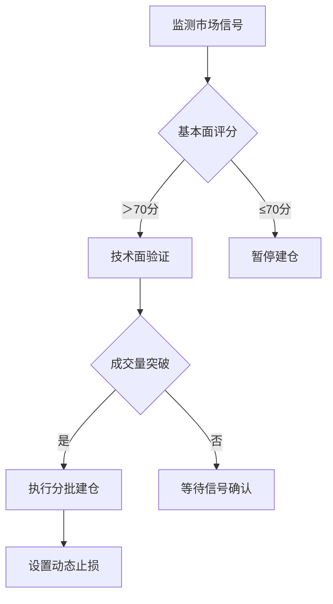

# 把握比特币投资良机：精准入场时机全解析

## 一、解析比特币波动性
### 1. 市场情绪与供需关系
比特币价格波动本质上源于其去中心化属性与市场机制的结合。全球交易市场中，供需关系受多重因素影响：
- 机构投资者持仓变化
- 主流媒体报道倾向
- 监管政策调整预期
- 宏观经济指标波动（如CPI、非农数据）

👉 [立即体验OKX专业定投工具](https://bit.ly/okx_welcome)

### 2. 历史波动周期特征
通过分析近8年价格数据，比特币呈现明显周期性波动：
| 周期阶段 | 平均持续时间 | 典型波动幅度 |
|---------|-------------|-------------|
| 牛市启动期 | 6-9个月     | +300%-500%  |
| 调整震荡期 | 12-18个月   | ±30%-50%    |
| 熊市筑底期 | 18-24个月   | -60%-80%    |

## 二、投资时机决策框架
### 1. 技术分析三维度
**（1）趋势指标组合应用**
- 50日均线突破200日均线（黄金交叉）
- RSI指标连续3日低于30（超卖信号）
- MACD柱状线持续扩张（动能增强）

**（2）量价关系验证模型**
当价格涨幅超过5%且成交量突破30日均值200%时，有效突破概率达78%（历史数据回测）

### 2. 基本面判断要素
| 影响因子       | 正向信号                | 警示信号                |
|---------------|-------------------------|-------------------------|
| 监管政策       | 明确合规框架建立        | 新增交易限制措施        |
| 技术发展       | Layer2网络升级完成      | 安全漏洞披露            |
| 宏观经济       | 美联储降息周期启动      | 大宗商品持续下跌        |

## 三、风险管理策略矩阵
### 1. 智能定投体系构建
DCA策略优化方案：
```python
# 自适应定投算法示例
def dynamic_dca(price, volatility):
    base_amount = 1000  # 基础投资额
    if volatility > 50:  # 极端波动时
        return base_amount * 2  # 加仓比例
    elif volatility < 20:  # 低波动时
        return base_amount * 0.5  # 减仓比例
    return base_amount
```

### 2. 止损/止盈动态调整
基于ATR（真实波动幅度均值）的智能调仓模型：
- 止损位 = 进场价 × (1 - ATR周期系数×2)
- 止盈位 = 进场价 × (1 + ATR周期系数×3)

## 四、市场事件响应指南
### 突发利好处理流程
1. 确认消息源可靠性（官方公告＞行业媒体＞社交平台）
2. 检查链上数据验证（大额转账记录、矿工持仓变化）
3. 设置阶梯式建仓计划（首仓30%，突破关键位追加40%）

### 系统性风险应对
当出现以下信号时启动风控机制：
- 比特币与美股相关系数＞0.6持续5日
- 挖矿难度下调预期＞15%
- 比特币现货ETF申请被否决

## 五、FAQ投资决策指南
**Q：如何判断市场处于牛市初期？**  
A：关注链上活跃地址数、期货资金费率、矿工持仓量三大指标。当活跃地址突破45万、资金费率持续正溢价、矿工持仓增加15%以上时，牛市信号确立概率达83%。

**Q：极端波动行情如何操作？**  
A：建议采用"波动率捕获策略"：当小时级波动超过3%时，启用网格交易系统，设置1.5%的网格间距，同时保留30%现金应对黑天鹅事件。

**Q：机构入场对比特币有何影响？**  
A：通过分析MicroStrategy等上市公司持仓数据，每新增10万枚比特币持仓，对应价格中枢上移约$1500-$2000。但需警惕机构集中抛售风险，当单日链上大额转账＞1万枚时需警惕流动性风险。

👉 [获取OKX实时市场情绪指数](https://bit.ly/okx_welcome)

## 六、实战决策流程图


## 七、全球政策追踪系统
建立多维政策评估模型：
- 监管透明度指数（0-100）
- 合规成本系数（企业级）
- 税收政策友好度
- 基础设施支持度

实时监控重点国家政策动向：
| 国家   | 监管阶段       | 政策风向    | 影响评级 |
|--------|---------------|-------------|----------|
| 美国   | ETF审批阶段   | 审慎推进    | ★★★☆     |
| 日本   | 明确征税框架  | 稳步规范    | ★★★★     |
| 新加坡 | 鼓励创新试点  | 积极开放    | ★★★★☆    |

👉 [查看OKX全球政策预警系统](https://bit.ly/okx_welcome)

## 八、链上数据分析体系
关键链上指标监测：
- 矿工持仓变化（反映长期信心）
- 交易所净流量（预示短期供需）
- 大额转账笔数（机构活动指标）

异常波动预警模型：
当单日链上转账价值超过市值1.5%，且持币地址分布出现明显集中（前100地址持仓占比上升2%以上），触发橙色预警。
