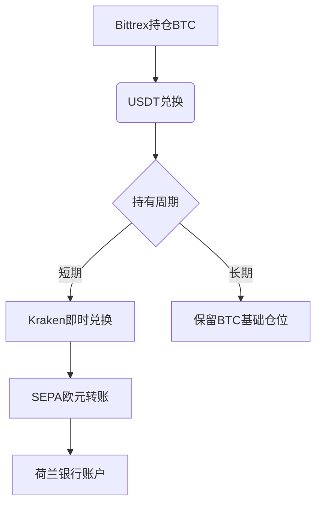

# 比特币、USDT与法币兑换全攻略：交易所选择与操作指南

## USDT的可信度解析
在加密货币交易领域，USDT（泰达币）作为主流稳定币长期存在争议。多位资深用户指出，虽然USDT官方宣称与美元1:1锚定，但其储备透明度问题始终是悬在投资者头上的达摩克利斯之剑。根据CoinMarketCap数据显示，USDT价格在极端市场环境下可能出现0.95-1.05美元的波动区间。

👉 [了解加密货币稳定币运作机制](https://bit.ly/okx_welcome)

对于荷兰投资者而言，选择交易所时建议优先考虑具备以下特征的平台：
- 通过欧盟EMI电子货币机构认证
- 支持SEPA欧元转账系统
- 提供荷兰语客户服务
- 拥有加密资产托管牌照

## 主流交易所横向评测

| 交易所       | 支持货币 | 法币通道 | 手续费率 | 荷兰认证 |
|--------------|----------|----------|----------|----------|
| Kraken       | BTC/USD/EUR | 银行转账 | 0.16%-0.26% | ✅       |
| Bitstamp     | BTC/USD/EUR | SEPA转账 | 0.10%-0.20% | ✅       |
| Coinbase     | BTC/USD/EUR | 银行/信用卡 | 0.50%-1.50% | ❌       |
| Bittrex      | BTC/USDT   | 仅加密货币 | 0.25%固定  | ❌       |

*数据来源：各交易所2025年官方费率表*

## 荷兰用户操作指南
针对荷兰地区的加密货币投资者，建议采用以下分步操作策略：

1. **资产转移**：将Bittrex持有的USDT通过TRC20网络快速转至Kraken
2. **法币兑换**：在Kraken平台将USDT/BTC挂单兑换为EUR
3. **资金归集**：通过SEPA系统将欧元转入荷兰境内银行账户
4. **税务申报**：使用荷兰税务局（Belastingdienst）的加密资产申报系统完成年度报税

👉 [探索全球合规加密平台](https://bit.ly/okx_welcome)

### 常见问题解答
**Q：USDT价格波动时如何规避风险？**  
A：建议采用分批兑换策略，在Kraken或Bitstamp设置条件单，当USDT/USD价格突破1.01时自动转为EUR。

**Q：荷兰有哪些本土加密平台？**  
A：Bitonic.nl是荷兰本土老牌交易所，支持iDEAL即时转账系统，但交易对较少，建议作为补充平台使用。

**Q：如何确保资金安全？**  
A：启用双重认证（2FA）+硬件钱包存储+定期更换API密钥的三重防护体系，参考荷兰央行（DNB）发布的《数字资产安全白皮书》建议。

## 风险对冲策略
对于持有大量加密资产的投资者，可考虑以下衍生品工具：
- 永续合约：在OKX设置BTC/EUR反向合约对冲
- 期权交易：通过Deribit平台购买欧式看跌期权
- 跨交易所套利：利用Kraken与Bitstamp的价差进行套利

👉 [掌握专业交易工具](https://bit.ly/okx_welcome)

## 税务合规要点
荷兰税务部门对加密货币采取分类征管模式：
- 投资目的持有：征收30%财富税（Box 3）
- 交易行为：按32%个人所得税率征税（Box 1）
- 矿工收入：视为经营所得，税率可达52%

建议使用CryptoTaxCalculator等专业工具进行自动化报税，确保符合荷兰《2025年数字资产税收实施细则》要求。

## 法币兑换操作流程图

