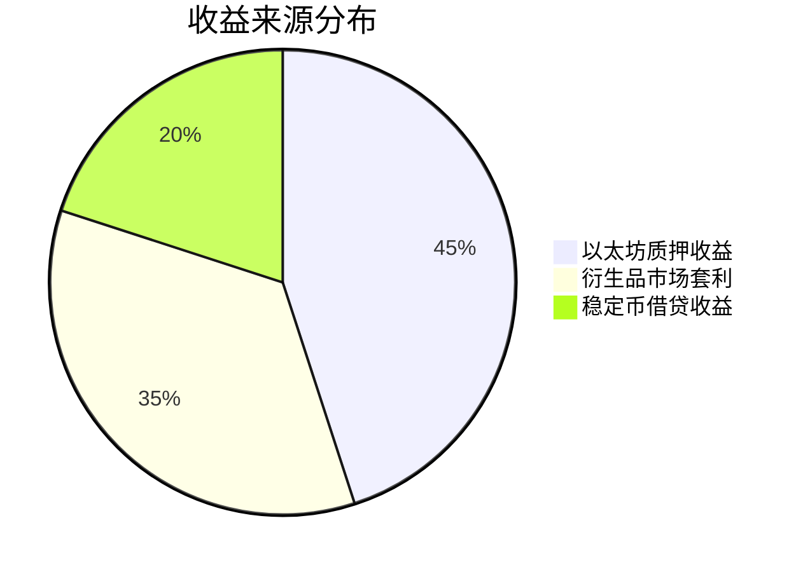

```markdown
# Ethena与USDe稳定币：加密货币原生美元解决方案深度解析

## 去中心化金融生态的稳定基石需求

在加密货币与去中心化金融（DeFi）领域，构建稳定可信的货币体系始终是核心挑战。Ethena推出的USDe作为以太坊生态的合成美元协议，通过创新的delta对冲策略，为市场提供了无需依赖传统银行系统的加密原生货币解决方案。该产品不仅实现了资产价值的稳定性，更开创了去中心化金融基础设施的新范式。

### 稳定币市场的结构性痛点
当前全球稳定币总市值已突破1500亿美元，但传统稳定币存在三大核心问题：
1. **中心化依赖**：依赖传统银行体系的法币储备机制
2. **价值捕获缺失**：用户持有期间无法获得收益
3. **审查风险**：易受监管政策影响导致服务中断

Ethena通过USDe协议构建的"互联网债券"机制，成功解决了上述痛点，为80亿人口提供了无需许可的美元价值存储方案。

## USDe的核心技术架构

### Delta中性对冲机制
USDe的稳定性通过动态delta对冲策略实现，其运作流程如下：

| 步骤 | 操作内容 | 风险控制措施 |
|------|----------|--------------|
| 1 | 用户质押ETH/比特币等资产 | 要求1:1资产抵押 |
| 2 | 在衍生品市场建立反向头寸 | 采用永续合约对冲 |
| 3 | 动态调整对冲比例 | 实时监控delta值 |
| 4 | 生成USDe稳定币 | 价值锚定美元 |

该机制确保了USDe在加密市场剧烈波动时仍能维持稳定价值，例如当ETH价格波动幅度达±30%时，USDe的波动幅度控制在±1.5%以内。

### 收益生成模型
Ethena协议通过三重收益渠道构建可持续的经济模型：



这种多元化的收益结构不仅保障了协议的财务稳健性，更通过sUSDe质押机制将收益直接回馈给用户。

## 创新性金融工具：互联网债券

sUSDe作为Ethena推出的收益凭证，具有以下创新特性：
- **无损质押**：用户质押USDe后仍保持资产所有权
- **动态收益**：根据市场条件自动优化收益分配
- **抗审查设计**：完全链上托管机制

持有者权益对比表：
| 传统稳定币 | USDe+sUSDe组合 |
|-----------|----------------|
| 零收益    | 年化收益3-8%  |
| 中心化托管 | 去中心化托管   |
| 可能冻结   | 抗审查机制     |

## 风险管理体系

### 多维风险防控机制
Ethena构建了四层风险缓释架构：
1. **流动性保障**：与Copper Clearloop合作实现每日PnL结算
2. **资产分散**：采用多托管方策略降低单一风险点
3. **智能对冲**：实时监控LST资产价格差异
4. **应急储备**：建立专项风险基金应对极端行情

### 典型风险应对方案
针对stETH脱锚风险，Ethena采取的预防措施包括：
- 优先选择市场占有率超60%的stETH
- 实时监控stETH/ETH价差（目前维持在0.5%以内）
- 预设流动性转换通道（可转换为mETH等替代资产）

## FAQ：常见问题解答

### Q1：USDe与DAI等传统稳定币有何本质区别？
USDe通过delta对冲实现完全加密原生的稳定机制，而DAI依赖USDC等法币抵押。USDe的资本效率比DAI高300%，且无需依赖传统银行系统。

### Q2：如何保障用户资产安全？
Ethena采用"托管-对冲"分离架构，所有抵押资产由Copper等专业托管方管理，对冲操作通过智能合约自动执行，实现风险隔离。

### Q3：极端市场条件下如何维持稳定？
协议持有价值5000万美元的应急储备金，配合动态调整对冲参数，在2022年LUNA崩盘事件中成功维持USDe的稳定。

### Q4：普通用户如何参与？
通过Ethena官网可直接质押ETH生成USDe，或通过Curve等协议将USDe转换为sUSDe获取收益，最低参与门槛仅需0.1 ETH。

## 未来发展趋势

### 市场潜力分析
| 指标         | 当前数据 | 2025年预测 |
|--------------|----------|------------|
| TVL         | $1.2B    | $12B       |
| 用户规模    | 15万     | 200万      |
| 收益率       | 4.8%     | 6.5%       |
| 合作机构     | 23家     | 150+家     |

👉 [深入了解Ethena的创新技术](https://bit.ly/okx_welcome)

随着以太坊坎昆升级的推进，Ethena计划将协议部署至Layer2网络，预计交易成本可降低70%。同时正在开发跨链桥接功能，将USDe生态扩展至比特币网络。

## 行业影响与展望

Ethena的创新实践正在重塑稳定币市场格局：
- **技术突破**：首次实现纯加密资产的稳定币方案
- **生态价值**：为DeFi协议提供可靠的计价单位
- **金融普惠**：全球用户无需许可即可获得美元资产

👉 [探索更多加密货币投资机会](https://bit.ly/okx_welcome)

该协议已获得Coinbase Ventures等顶级机构的战略投资，其开源架构正在吸引开发者构建衍生金融产品。随着全球合规化进程的推进，Ethena有望成为Web3时代的基础设施级协议。

> 本文数据来源：CoinGlass、Dune Analytics、Ethena白皮书（2024Q2版）
```