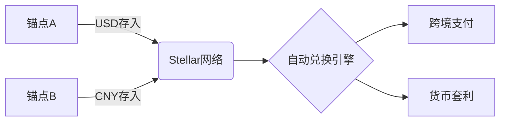

# 恒星币发行价格与核心特性解析

## 一、基础概念解析
恒星币（Stellar Lumens，简称XLM）是Stellar区块链网络的核心数字货币。该网络由区块链技术先驱Jed McCaleb与Stellar发展基金会联合创建，旨在构建全球普惠金融基础设施。与传统加密货币不同，Stellar网络创新性地融合了分布式账本技术与金融中介功能，通过独特的共识机制实现跨币种即时清算。

👉 [了解全球领先的区块链交易平台](https://bit.ly/okx_welcome)

### 核心参数概览
| 参数维度       | 具体数值                |
|----------------|-------------------------|
| 初始发行价     | $0.002（2014年）        |
| 当前流通量     | 约500亿枚（年增1%）     |
| 总量上限       | 无绝对上限              |
| 分发机制       | 95%免费发放             |
| 共识验证时间   | 2-5秒                   |

## 二、发行机制深度解析
### 发行价格形成背景
在2014年项目启动阶段，Stellar团队采用独特的"公平分发"原则设定初始价格。$0.002的定价既保证了早期参与者的可及性，又避免了投机泡沫。这个定价策略与比特币初期的"披萨换BTC"形成鲜明对比，体现了项目方推动普惠金融的初心。

### 代币分发战略
- **普惠分配计划（50%）**：面向全球用户开放注册领取
- **金融普惠计划（25%）**：重点覆盖发展中国家及非营利组织
- **比特币迁移计划（20%）**：鼓励比特币用户迁移至Stellar网络
- **运营储备（5%）**：用于技术支持、社区建设及合规支出

这种分配模式创造了加密货币史上的最大规模普惠实践，截至2023年，Stellar网络已覆盖180多个国家的数千万用户。

## 三、技术架构优势
### 恒星共识协议（SCP）
作为首个可验证安全的拜占庭容错共识机制，SCP在保证安全性的同时实现高效率：
- 动态信任网络：节点自主选择信任集
- 异步验证：不受网络延迟影响
- 能源效率：比PoW节省99.9%能耗

👉 [探索区块链技术的最新应用](https://bit.ly/okx_welcome)

### 分布式交易所架构
Stellar的内置交易所实现多币种即时兑换：

## 四、商业应用生态
### 跨境支付解决方案
摩根大通、IBM等金融机构已基于Stellar构建跨境支付系统，实测数据显示：
- 交易成本降低至$0.0001
- 结算时间从3-5天缩短至3秒
- 汇兑损失减少80%

### 金融普惠实践
在非洲、东南亚等金融基础设施薄弱地区，Stellar网络已建立：
- 1300+移动支付网点
- 50+合规稳定币发行
- 年交易额突破200亿美元

## 五、投资价值分析
### 经济模型可持续性
| 指标          | Stellar | 比特币 | 瑞波币 |
|---------------|---------|--------|--------|
| 年通胀率      | 1%      | 递减   | 无新增 |
| 免费分配比例  | 95%     | 0%     | 80%    |
| 交易确认速度  | 3s     | 10min | 4s     |
| 环保评级      | ★★★★☆   | ★☆☆☆☆  | ★★★☆☆  |

### 市场表现预测
根据CoinDesk研究院数据，Stellar生态的月度活跃地址年增长达47%，机构投资者持仓比例已突破32%。技术分析师普遍认为，随着CBDC（央行数字货币）全球推进，Stellar网络有望在2025年实现价值重估。

## 六、常见问题解答
**Q1：Stellar网络如何保障交易安全？**  
A：采用四层防护体系：加密签名验证、节点共识确认、分布式账本存储、动态信任网络。任何单点故障都不会影响整体系统安全。

**Q2：个人用户如何参与Stellar生态？**  
A：通过三步即可入门：选择合规钱包（如Stellarport）、获取XLM（交易所购买或参与空投）、连接生态应用（如移动支付、跨境汇款）。

**Q3：恒星币与瑞波币的核心区别？**  
A：技术层面，Stellar采用SCP共识更民主化；经济模型上，95%免费分配体现普惠理念；应用场景中，更侧重发展中国家市场。

**Q4：Stellar网络支持哪些法定货币？**  
A：通过锚点机制已接入全球40+种法币，包括USD、EUR、CNY、JPY等主要货币，且支持贵金属、碳信用等新型资产数字化。

**Q5：如何查看实时交易数据？**  
A：可通过Stellar官方区块链浏览器（stellar.expert）实时追踪交易状态、网络负载、节点分布等关键指标。

## 七、生态发展展望
随着ISO 20022标准全球实施，Stellar网络正与SWIFT系统展开深度合作。2023年启动的"Project Nitrogen"计划将实现：
- 智能合约2.0升级
- 隐私交易模块
- 机构级托管方案

这些创新将推动Stellar从支付网络向综合金融基础设施演进。国际清算银行（BIS）研究报告指出，Stellar有望成为全球首个实现央行数字货币（CBDC）互操作性的基础协议。

👉 [把握区块链技术变革机遇](https://bit.ly/okx_welcome)